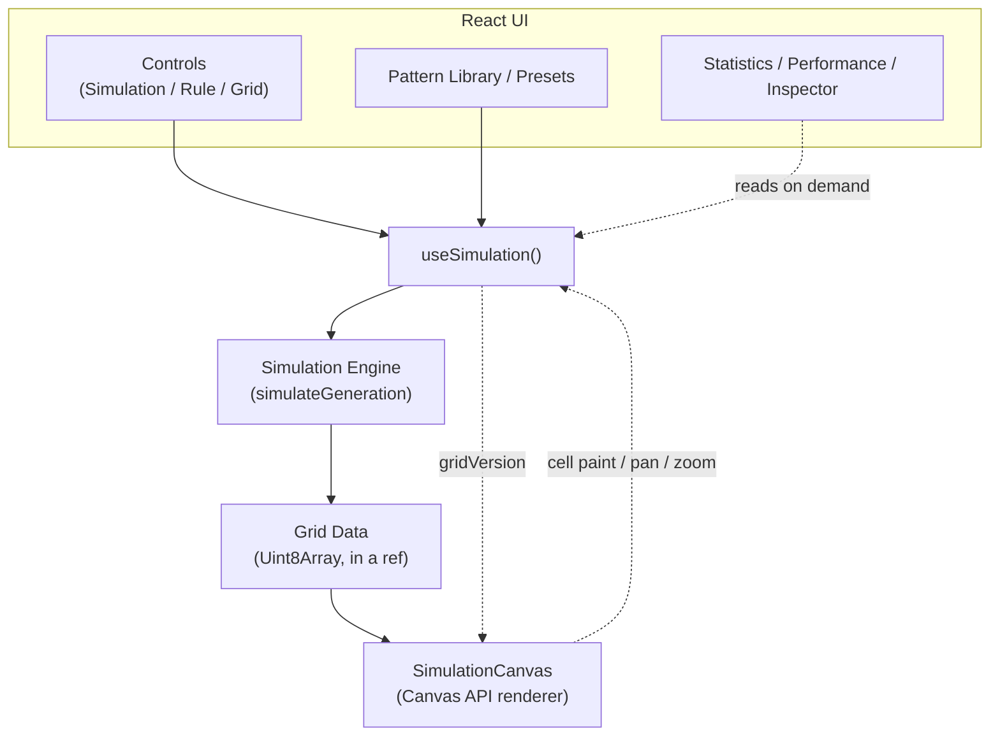

# Cellular Automata Lab

A browser-based cellular automata simulation and experimentation environment, built with React and the Canvas API. Inspired by Conway's Game of Life, but built as a general rule-driven simulation lab rather than a single fixed automaton.

**Live demo:** https://fazal305.github.io/cellular-automata-lab/

## Table of Contents

1. [What This Is](#what-this-is)
2. [Why It Exists](#why-it-exists)
3. [Cellular Automata & Conway's Game of Life](#cellular-automata--conways-game-of-life)
4. [Features](#features)
5. [Screenshots](#screenshots)
6. [Architecture](#architecture)
7. [React Architecture](#react-architecture)
8. [Why Canvas, Not DOM](#why-canvas-not-dom)
9. [Why useRef Matters Here](#why-useref-matters-here)
10. [Simulation Engine](#simulation-engine)
11. [Performance Strategy](#performance-strategy)
12. [Custom Hooks](#custom-hooks)
13. [Pattern System](#pattern-system)
14. [Local Persistence](#local-persistence)
15. [Keyboard Shortcuts](#keyboard-shortcuts)
16. [Installation](#installation)
17. [Development](#development)
18. [Production Build](#production-build)
19. [Lessons Learned](#lessons-learned)
20. [Future Improvements](#future-improvements)

## What This Is

Cellular Automata Lab is a simulation and experimentation tool for two-dimensional outer-totalistic cellular automata — the family of rule systems that includes Conway's Game of Life. It lets you draw starting conditions by hand, load classic patterns, switch between four different rule sets, control simulation speed, inspect live statistics, and save/export your own patterns as JSON — all running entirely client-side, no backend.

It's built to portfolio/production standard rather than as a tutorial: the simulation math is fully decoupled from React, rendering uses the Canvas API instead of thousands of DOM nodes, and the codebase demonstrates a deliberate set of React patterns (custom hooks, refs for high-frequency state, memoization where it actually matters) rather than using them reflexively.

## Why It Exists

This project was built to demonstrate:

- How to keep a computationally intensive simulation loop out of React's render cycle without losing React's benefits for UI/state.
- A concrete, working answer to "when should you use Canvas instead of React components" — not as a rule of thumb, but as code you can read and measure.
- A generic rule engine that treats Conway's Game of Life as one instance of a broader rule family, not a special case.

## Cellular Automata & Conway's Game of Life

A cellular automaton evolves a grid of cells generation by generation according to a fixed local rule: each cell's next state depends only on its own current state and the states of its neighbors. Conway's Game of Life is the canonical example, using the 8 surrounding cells (the Moore neighborhood) and this rule:

1. A live cell with fewer than 2 live neighbors dies (underpopulation).
2. A live cell with 2 or 3 live neighbors survives.
3. A live cell with more than 3 live neighbors dies (overpopulation).
4. A dead cell with exactly 3 live neighbors becomes alive (reproduction).

```
Generation 1        Generation 2        Generation 3
  . # .                . . .               . # .
  . . #        →       # . #        →      . # #
  # # #                . # .               . # .
```

This app expresses that rule (and three others — HighLife, Seeds, and Day & Night) in **B/S notation**: a `birth` list of neighbor counts that bring a dead cell to life, and a `survival` list of neighbor counts that keep a live cell alive. All four rules are evaluated by the exact same function (see [Simulation Engine](#simulation-engine)) — they differ only in which numbers appear in those two lists.

## Features

- Draw, erase, and drag-paint cells directly on the canvas
- Play / Pause / Step / Reset / Randomize / Clear controls
- Five speed presets plus a continuous speed slider
- Four cellular automaton rules: Conway's Game of Life, HighLife, Seeds, Day & Night
- Adjustable grid dimensions, cell size, wrap-around (toroidal) edges, and grid-line visibility
- Pan and zoom on the canvas (mouse wheel to zoom centered on cursor; shift-drag or middle-click to pan)
- A bundled pattern library: Glider, Blinker, Block, Beacon, Pulsar, Lightweight Spaceship, and the Gosper Glider Gun
- Curated "quick start" presets that configure rule, grid size, and starting pattern in one click
- Save your own patterns from the current grid, with local persistence
- Import/export patterns and grids as JSON, plus copy-to-clipboard
- Live statistics: generation, population, grid size, elapsed time, generation compute time
- A developer-facing performance monitor: FPS, generation time, render time, cells rendered
- Dark/light theming via CSS custom properties, persisted locally
- Full keyboard shortcut support
- Responsive layout down to mobile, with a collapsible sidebar
- `prefers-reduced-motion` support

## Screenshots

_Screenshots are not included in this repository — none were supplied for this README, and none were fabricated. Run the app locally or visit the [live demo](https://fazal305.github.io/cellular-automata-lab/) to see it in action._

## Architecture



React owns configuration, controls, and UI state. The simulation engine is pure and framework-agnostic. The live grid lives in a ref, not React state. The canvas reads that ref directly and redraws on its own loop — React only tells it *that* something changed (`gridVersion`), never *what*.

### Folder structure

```
src/
├── components/     UI only — no simulation math, no direct rAF loops
├── hooks/          Reusable stateful logic (simulation lifecycle, animation, canvas, storage, shortcuts, perf)
├── simulation/      Pure math: grid, neighbor counting, rules, engine, presets — zero React imports
├── utils/          Stateless helpers: coordinates, RNG, pattern (de)serialization
├── config/         Centralized config: speeds, grid limits, keyboard map, storage keys
└── data/           Bundled pattern cell data
```

## React Architecture

Each hook in `useState` is used for values the UI needs to read and re-render on: run/paused state, generation count, rule/speed/grid selection, theme, sidebar visibility. None of it holds the actual per-cell grid data — see [Why useRef Matters Here](#why-useref-matters-here).

`useEffect` is used for genuine side effects with clear dependencies: syncing the `data-theme` attribute to the DOM, tracking `matchMedia` for responsive sidebar behavior, persisting to `localStorage`, and feeding the performance monitor. Nothing runs "just in case" — if an effect's dependency array is empty, it's because the effect genuinely only needs to run once (event listener setup with cleanup).

`useMemo` is used for values that are meaningfully expensive to recompute and don't need to change every render: the selected rule object, per-generation statistics (alive/dead counts), the memoized `usePerformanceMonitor` return value (see [Performance Strategy](#performance-strategy)).

`useCallback` is used specifically where a stable function reference matters for a child that's wrapped in `React.memo` (`SimulationCanvas`, `PatternCard`) or that's a dependency of another hook (`useAnimationLoop`, `useKeyboardShortcuts`). It is not applied reflexively to every function in the file.

## Why Canvas, Not DOM

A 200×150 grid is 30,000 cells. Mounting one `<Cell />` React component per cell — and reconciling all 30,000 of them every single generation, potentially dozens of times per second — would burn far more time in React's reconciler than the simulation math itself ever costs. The app renders the entire grid with a single `<canvas>` and plain `fillRect` calls in a tight loop, with viewport culling so only cells actually visible in the current pan/zoom window are drawn. React's job stops at "hand the canvas a grid reference and a version number" — everything past that is imperative Canvas API code, deliberately outside React's render cycle.

## Why useRef Matters Here

The live grid (`Uint8Array`) is held in a ref, not `useState`. Putting a 10,000+ cell grid into React state would mean React comparing/holding a new array reference on every generation — copying or diffing data React never actually needs to look inside. Instead:

- `gridRef.current` holds the actual cells (mutated in place by the engine).
- `gridVersion`, a small integer in `useState`, increments on every mutation.
- Consumers (`SimulationCanvas`) depend on `gridVersion` purely as a "redraw now" signal, then read `getGrid()` (backed by the ref) directly.

Refs are also used for the animation frame ID (`useAnimationLoop`), the camera/pan/zoom state (`SimulationCanvas`), and cached theme colors — all high-frequency or purely-imperative values that have no business triggering a React re-render.

## Simulation Engine

Located entirely in `src/simulation/`, with zero React imports:

- `grid.js` — grid creation, cell access/mutation, resize, randomize, pattern stamping. Backed by `Uint8Array` (1 byte per cell) rather than nested arrays of objects, for memory density and fast cloning.
- `neighborCounter.js` — Moore-neighborhood (8-neighbor) counting, with or without toroidal wrap-around.
- `rules.js` — the four bundled rules, expressed in B/S (birth/survival) notation.
- `gameOfLife.js` — the single generic evaluator that all four rules share.
- `simulationEngine.js` — `simulateGeneration(grid, width, height, rule, options)`, a pure function: same input always produces the same output, and the input grid is never mutated.

This separation means the entire simulation is independently testable and reusable outside the browser (e.g. in a future Web Worker) without touching a single React file.

## Performance Strategy

- **Canvas over DOM** for the grid itself (see above).
- **Viewport culling**: only cells inside the current pan/zoom window are iterated during a draw call.
- **`requestAnimationFrame`, not `setInterval`**, for the simulation loop (`useAnimationLoop`) — it self-throttles to the display's actual refresh rate, pauses automatically in background tabs, and its cleanup guarantees exactly one loop is ever running.
- **A separate always-on draw loop** for the canvas itself, independent from the simulation's step cadence, so pan/zoom/hover stays smooth even while the simulation is paused.
- **Throttled performance metrics**: `usePerformanceMonitor` accumulates FPS/generation-time/render-time in refs and only flushes into React state twice a second, so a 60-generations/sec simulation doesn't force 60 re-renders/sec in the stats panel.
- **`React.memo`** on `SimulationCanvas` and `PatternCard`, paired with stable (`useCallback`/`useMemo`) prop references, so unrelated App-level state changes (theme, sidebar toggle) don't cascade into re-rendering the canvas or every pattern card.

## Custom Hooks

- **`useSimulation`** — owns the full simulation lifecycle: grid ref, generation count, run state, rule/speed/wrap selection, and the step/start/stop/reset/randomize/setCell/setGridSize/placePattern/loadScenario API.
- **`useAnimationLoop`** — a reusable `requestAnimationFrame`-based ticker with configurable interval, remainder-carrying (no drift), and guaranteed single-instance cleanup.
- **`useCanvas`** — owns canvas element lifecycle: 2D context acquisition and devicePixelRatio-aware resizing via `ResizeObserver`.
- **`useLocalStorage`** — `useState` mirrored to `localStorage`, with read/write wrapped in try/catch so private-browsing or quota errors degrade gracefully instead of crashing the app.
- **`useKeyboardShortcuts`** — subscribes once to `keydown`, dispatches to a handler map by action name, ignores keystrokes while typing in form fields.
- **`usePerformanceMonitor`** — see [Performance Strategy](#performance-strategy).

## Pattern System

Seven bundled patterns (`src/data/defaultPatterns.js`) — Glider, Blinker, Block, Beacon, Pulsar, Lightweight Spaceship, Gosper Glider Gun — each verified by running them through the actual simulation engine (the Blinker oscillates, the Glider translates without changing population, the Pulsar returns to its exact original state after 3 generations, the Gosper Gun's population grows as it emits gliders). Four curated presets (`src/simulation/presets.js`) combine a rule, grid size, and pattern into one-click scenarios. Users can save their own patterns from the current grid, delete them, and import/export any pattern as JSON via `utils/patternSerializer.js` / `utils/patternParser.js` — the parser validates shape and reports specific errors for malformed input rather than throwing.

## Local Persistence

`localStorage` stores two things: user preferences (theme, cell size, grid-line visibility) and the list of custom saved patterns. The live simulation grid itself is intentionally **not** persisted — it can be arbitrarily large, and localStorage isn't a fit for that; save/export a pattern explicitly instead if you want to keep a specific grid state.

## Keyboard Shortcuts

| Key | Action |
|---|---|
| `Space` | Play / Pause |
| `N` | Next generation |
| `S` | Step |
| `R` | Randomize grid |
| `C` | Clear grid |
| `Esc` | Close panels |

Shortcuts are disabled while typing into a text field, and the same list is shown in-app in the Inspector panel — both are driven from a single config array (`src/config/constants.js`) so they can't drift out of sync.

## Installation

```bash
git clone https://github.com/fazal305/cellular-automata-lab.git
cd cellular-automata-lab
npm install
```

## Development

```bash
npm run dev
```

Starts the Vite dev server with hot module reloading.

## Production Build

```bash
npm run build
npm run preview   # serve the production build locally to sanity-check it
```

Deployment to GitHub Pages is automated via `.github/workflows/deploy.yml` on every push to `main`.

## Lessons Learned

- **A one-time `window.innerWidth` read at mount is not the same as "responsive."** The sidebar's open/closed state was originally initialized from a single `useState(() => window.innerWidth >= breakpoint)` call. In practice this can race the actual layout pass and never update again on resize. It was replaced with a `matchMedia` listener that both reads the correct value after mount and reacts to real viewport changes going forward.
- **`aria-hidden` has to track what's actually visually hidden, not a UI toggle's intent.** The sidebar was briefly marked `aria-hidden` whenever its "open" flag was false — but on desktop layouts the sidebar is always visually present regardless of that flag. Fixed by moving the hide/show semantics entirely into CSS (`visibility`), so assistive tech and sighted users see the same thing.
- **Rendering 30,000 individual components genuinely is the wrong call** — this was validated concretely (not just assumed) by building the Canvas-based renderer and comparing the amount of work per generation: a single loop of `fillRect` calls versus what would have been tens of thousands of component re-renders.
- **`requestAnimationFrame` pauses in backgrounded/hidden tabs** — verified directly while building this project (rAF simply never fires when `document.visibilityState !== 'visible'`). This is correct, desirable behavior for a simulation loop, but worth knowing explicitly if you're debugging why an animation "isn't running."

## Future Improvements

- Move the simulation engine into a Web Worker so extremely large grids (hundreds of thousands of cells) don't share the main thread with input handling.
- Multi-touch pinch-to-zoom on touch devices (currently: tap to toggle, drag to paint, mouse wheel to zoom).
- A pattern "ghost preview" that follows the cursor before placement, instead of always centering on click.
- IndexedDB-backed pattern storage for users who accumulate many large custom patterns beyond comfortable localStorage size.
- Additional rule presets and a UI for defining fully custom B/S rules without editing `rules.js`.
